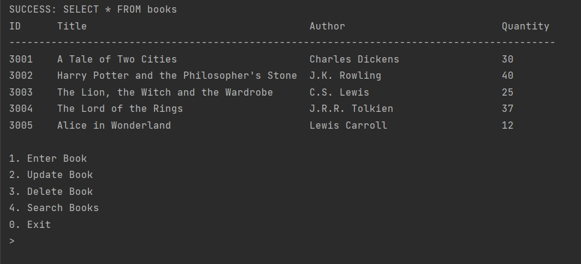

# Book Store App
This is a simple terminal app that lets the user keep track of a bookstore inventory. 
## Description
This application utilizes an SQL Lite database to store information about books. It lets the user add new book data to the database and query existing records.
## Installation
There is not much to the installation process. The project consists of a single .py file. There are no specific requirements to run the file as it only uses python built-in libraries.
You need to have Python installed on your machine to execute .py files.
## Usage
* Simply run main.py file to start the application. Once started you should be presented with the following output

* At the top you will see the records from a sample database that is created upon the first run.
* To manipulate the database simply type in an option number and follow subsequent instructions.
## Credits
I would like to thank the team at HyperionDev for making this little project a reality :)
To find out more about HyperionDev follow the link:
[HyperionDev](https://www.hyperiondev.com)
